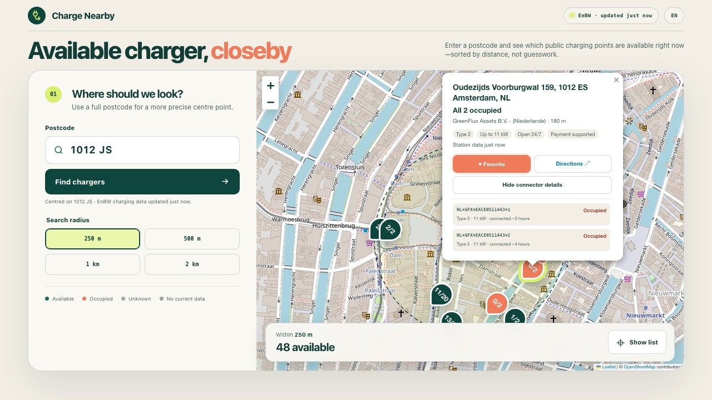
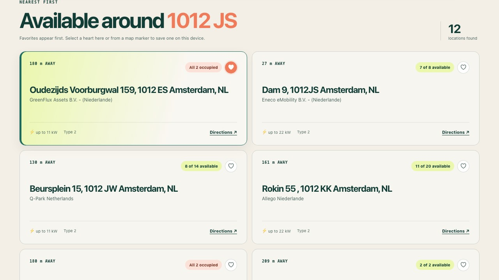

# Charge Nearby

[](https://github.com/roelsroels/charge-nearby/actions/workflows/validate.yml)

A small private-network website for finding currently available public EV charging stations around an Amsterdam postcode.

The browser uses PDOK to locate the postcode. A dependency-free Node service fetches charger locations and availability from the EnBW mobility+ map backend, resolves grouped map results, briefly caches searches, and serves the frontend. The EnBW key never reaches the browser or repository.

## Screenshots





> [!IMPORTANT]
> This is an unofficial private tool. It is not affiliated with or supported by EnBW. The EnBW web-map endpoint and browser key can change without notice.

## Quick start with Docker

Requirements: Docker with Compose.

```sh
cp .env.example .env
```

Put the current EnBW browser key in `.env`, then start the service:

```sh
docker compose up -d --build
```

Open `http://localhost:8080`. From another device on the same network, use `http://<server-lan-ip>:8080`.

The `.env` file is ignored by Git. Do not commit the real key.

## Run directly with Node.js

Requirements: Node.js 22 or newer.

```sh
ENBW_API_KEY="your-current-key" HOST=0.0.0.0 PORT=8080 npm start
```

Use `HOST=127.0.0.1` when access should be limited to the same computer.

## Obtain or replace the key

The EnBW map delivers a shared Azure API Management key to browsers:

1. Open the [EnBW charging map](https://www.enbw.com/elektromobilitaet/produkte/mobilityplus-app/ladestation-finden/map).
2. Open the browser developer tools and select the Network panel.
3. Select a charging station.
4. Find a request to `api.emp.emob-enbw.com`.
5. Copy the `Ocp-Apim-Subscription-Key` request header into `.env` as `ENBW_API_KEY`.

Restart the service after changing `.env`:

```sh
docker compose up -d --force-recreate
```

The health endpoint reports whether a key is configured without exposing it:

```sh
curl http://localhost:8080/api/health
```

## Reverse proxy

The Node service must handle both the website and `/api/chargers`. Do not serve `html/` by itself. An nginx reverse-proxy example is available in `nginx/charge-nearby.conf.example`.

Keep this deployment behind a private LAN, VPN, firewall, or authenticated reverse proxy. The application itself does not implement user authentication.

## Data behavior

- Searches are restricted to Amsterdam and its immediate surroundings.
- Supported radii are 250 m, 500 m, 1 km and 2 km.
- Results are cached for 60 seconds; a cached result up to 15 minutes old is used if EnBW temporarily fails.
- Favorite stations are stored only in the current browser and highlighted in both the results and map.
- Dense searches can require many EnBW requests because the upstream API returns grouped markers. The service expands those groups with a concurrency and request limit.
- An available connector does not guarantee an empty or accessible parking space.
- Operators can be named differently across roaming providers.

The complete data flow is documented in `docs/DATA.md`.

## Why the original NDW source was replaced

The earlier static prototype used an Amsterdam-wide NDW/DOT-NL snapshot. That feed was reliable enough technically, but a side-by-side Amsterdam coverage audit found multiple operator locations in commercial roaming apps that were absent from the raw NDW response.

This was an upstream coverage gap rather than a postcode, radius, or rendering defect. The EnBW-backed implementation returned substantially more nearby locations. The historical finding is retained here because NDW should not be reintroduced as the sole data source without first rechecking its operator coverage.

## Checks

```sh
npm run check
npm test
```

The automated tests use simulated EnBW responses and do not need a real key. A live verification can be performed after starting the service and searching for `1012 JS`.

## Project layout

- `server.mjs` — local HTTP server, cache and API route
- `lib/enbw.mjs` — EnBW client, cluster expansion and data normalisation
- `html/` — browser frontend
- `compose.yaml` and `Dockerfile` — private-network container deployment
- `tests/` — unit, server and frontend smoke tests

## License

The Charge Nearby source is MIT licensed. EnBW, mobility+ and their data are not covered by this repository’s licence.
